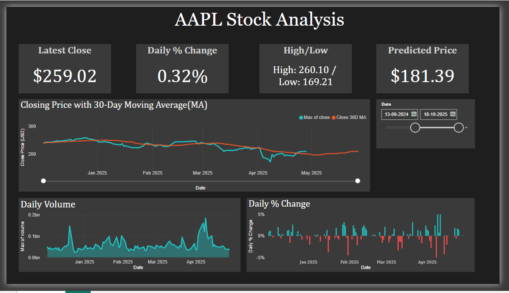

# Interactive-Stock-Market-Dashboard-with-Alpha-Vantage
# AAPL Stock Dashboard

An end‑to‑end project that pulls Apple (AAPL) daily stock prices from Alpha Vantage, adds basic technical indicators and a Prophet forecast, and visualises the results in a dark‑theme Power BI report.

---

## Structure
| Folder / file | Purpose |
|---------------|---------|
| `scripts/fetch_data.py` | Python script: download OHLC data, add RSI & MACD, save CSVs |
| `notebooks/technical_analysis.ipynb` | Jupyter notebook: 30‑day Prophet forecast |
| `data/` | Output CSVs  |
| `dashboard/aapl_analysis.pbix` | Power BI report (interactive dashboard) |
| 

---

# set your API key

ALPHA_VANTAGE_KEY='YOUR_KEY'

